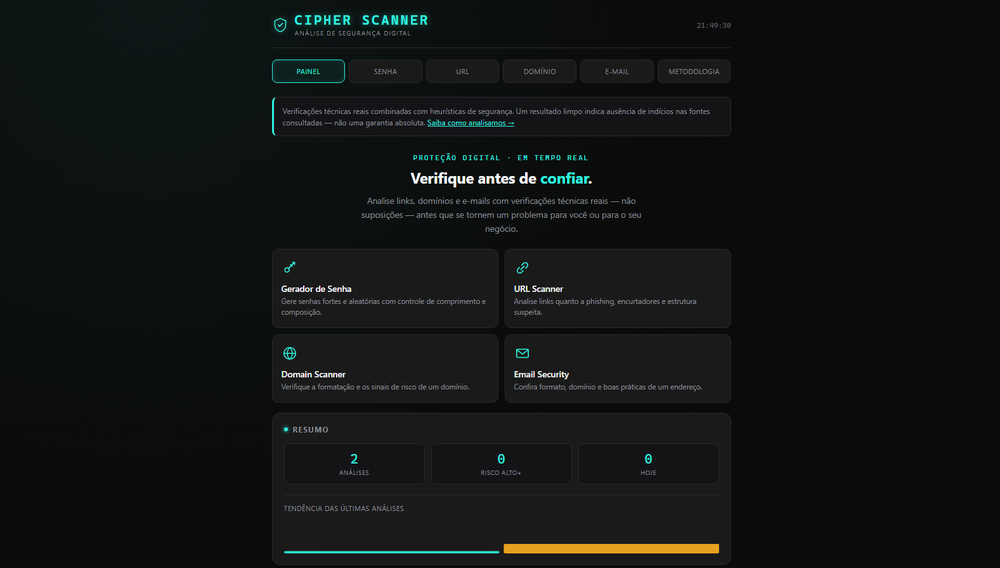
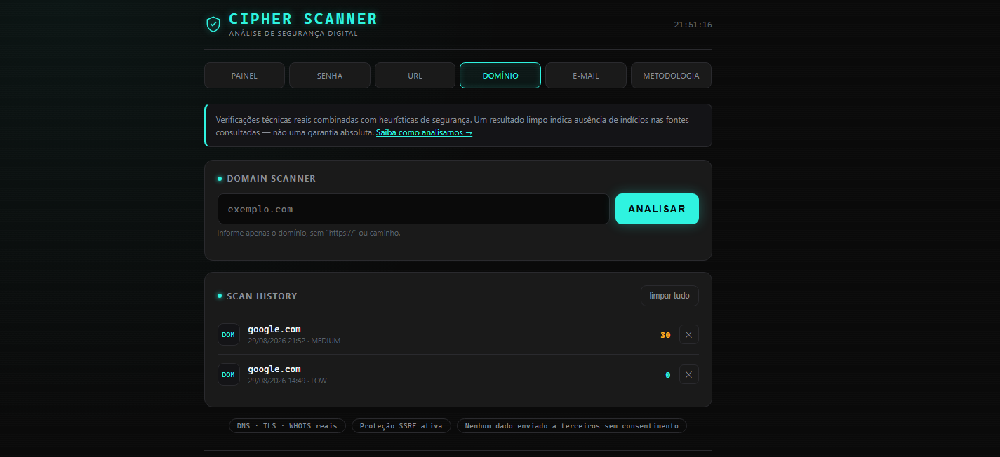
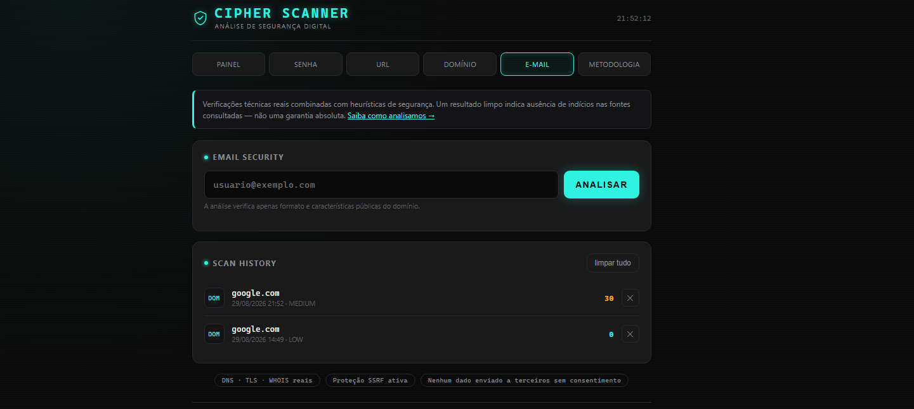
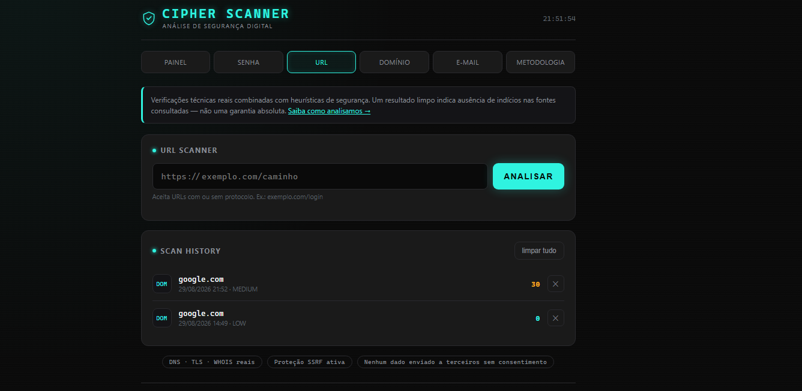
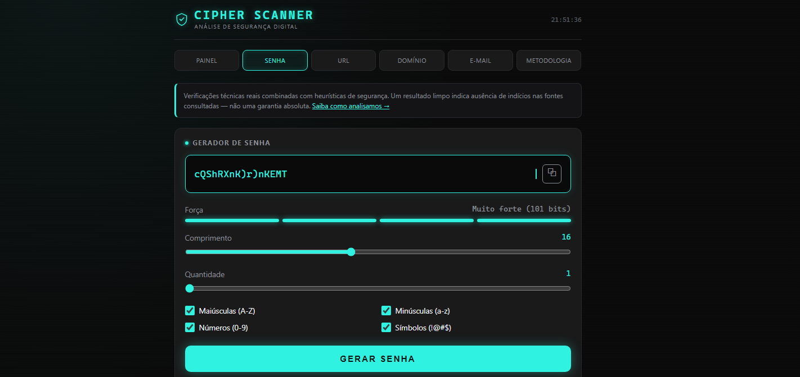

# CIPHER Technologies

<div align="center">


Cybersecurity platform focused on security awareness, information, and digital security resources.

🌐 Live Demo: https://cipher-technologies.netlify.app/

</div>

---

# About

CIPHER Technologies is a collaborative cybersecurity project created to promote digital security awareness and provide information related to cybersecurity, ethical hacking, penetration testing, online safety, and security best practices.

This repository serves as the project's source code archive and portfolio reference.

---

# Features

- Modern responsive interface
- Cybersecurity-focused website
- Security awareness content
- Professional landing page
- Mobile-friendly design
- Fast loading
- Hosted on Netlify

---

# Technologies Used

- HTML5
- CSS3
- JavaScript
- Netlify

---

# Project Structure

```
cipher-technologies/
│
├── index.html
├── apps/
├── css/
├── js/
├── images/
└── README.md
```

---

# Live Website

Visit the project:

https://cipher-technologies.netlify.app/

---

# My Contribution

I participated in the development and maintenance of this collaborative project.

My contributions included:

- Front-end development
- Website improvements
- Project organization
- Deployment support
- Cybersecurity content

---

# Objectives

The project aims to:

- Promote cybersecurity awareness
- Share security knowledge
- Encourage ethical hacking
- Support students and beginners
- Create a professional online presence

---

# Future Improvements

- User authentication
- Security blog
- Vulnerability news
- Interactive learning resources
- Cybersecurity tools integration
- Dashboard
- API integration

---

## 📸 Screenshots

### Dashboard



---

### Domain Scanner



---

### Email Security



---

### URL Scanner



---


### Password Gerator



---

# Team

CIPHER Technologies is a collaborative project developed by multiple contributors.

---

# Deployment

The project is deployed using Netlify.

---

# License

This project is intended for educational and portfolio purposes.

---

# Author

**Cristiano Martins**

Cybersecurity Student

Ethical Hacker

Penetration Tester

Bug Bounty Researcher

GitHub:
https://github.com/cristiano-martins

LinkedIn:
https://linkedin.com/in/cristiano-martins-161575366/

---

## Disclaimer

This project is intended for educational, awareness, and portfolio purposes only.

The information presented does not encourage illegal activities. Always act ethically and within applicable laws.
